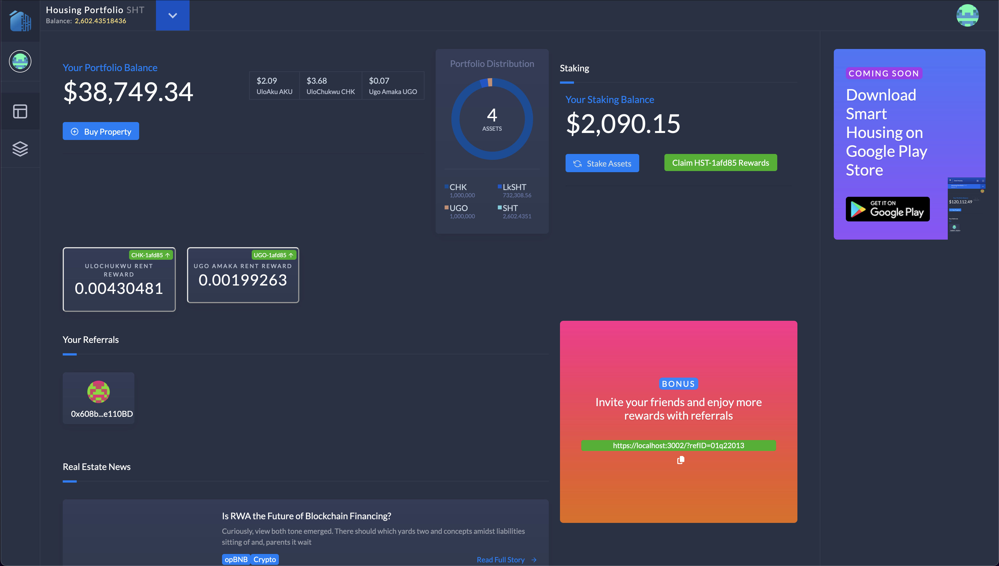
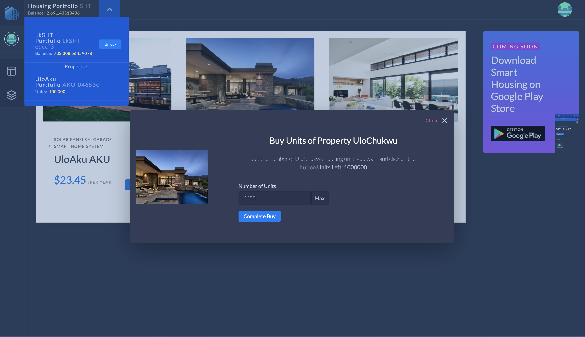

# SmartHousing

## Overview

### Challenges in Nigeria's Real Estate Market

Nigeria faces a significant housing deficit, with a need for 550,000 housing units annually and an estimated cost of N5.5 trillion over the next decade. This shortage presents a challenge for both low-income earners and developers, with high costs and limited access to real estate investments. The traditional real estate market is characterized by:

-   **High Entry Costs:** The large capital required for property investment limits participation to wealthy individuals and institutions.
-   **Limited Liquidity:** Real estate investments are often illiquid, making it difficult for investors to access funds quickly.
-   **Inefficient Development Funding:** Developers struggle with securing timely funding for affordable housing projects.

### SmartHousing Solution

SmartHousing aims to address these challenges through Real World Asset Tokenization, leveraging blockchain technology to:

-   **Enable Fractional Ownership:** By tokenizing properties, SmartHousing allows individuals to own fractions of real estate assets, making it accessible to low-income earners.
-   **Provide Liquidity to Developers:** The platform offers developers immediate access to liquid funds through token sales, facilitating timely and quality completion of projects.
-   **Democratize Real Estate Investment:** By lowering the entry barriers, SmartHousing makes real estate investments more inclusive and accessible.

_Dashboard View_

_Properties View_

## Key Features

### Tokenization

SmartHousing utilizes blockchain technology to tokenize real estate properties. This process involves:

-   **Fractional Ownership:** Properties are divided into tokens, each representing a share of the property. Investors can buy and trade these tokens, thereby owning a fraction of the property.
-   **Ease of Investment:** Tokenization reduces the capital required for investment, allowing broader participation in real estate.

### Native Tokens

SmartHousing employs a native token, the SmartHousing Token (SHT), which serves multiple purposes:

-   **Utility Token:** Used for transactions within the platform, including buying property tokens and participating in governance.
-   **Staking and Rewards:** Token holders can stake SHT to earn rewards and participate in the platform's governance.

### Staking

-   **Staking Mechanism:** Users can stake their SHT tokens to earn rewards and gain voting power in governance decisions.
-   **Rewards:** Staking rewards are distributed based on the amount and duration of tokens staked.

### Referral System

-   **Referral Rewards:** Users can earn rewards by referring new investors to the platform. The referral system incentivizes the growth of the SmartHousing community.
-   **Tracking and Bonuses:** Referrals are tracked through unique referral codes, and bonuses are awarded based on the investments made by referred users.

## Impact

### Economic Benefits

-   **Increased Accessibility:** By fractionalizing property ownership, SmartHousing opens up real estate investment to a broader audience, including those with lower capital.
-   **Enhanced Liquidity:** The tokenization of real estate provides a more liquid investment option, allowing investors to buy, sell, and trade property tokens easily.
-   **Accelerated Development:** Developers gain quicker access to funding, promoting the timely completion of affordable housing projects.

### Social Benefits

-   **Affordable Housing:** The platform supports the development of affordable housing, addressing the housing shortage in Nigeria.
-   **Community Engagement:** The referral system and staking mechanisms foster a strong, engaged community of investors and stakeholders.

## Architecture

The SmartHousing ecosystem architecture integrates several key components: the `SmartHousing`, `ProjectFunding`, `Coinbase`, and `HousingProject` contracts. Here’s a summary of how these components interact within the ecosystem.

### 1. **SmartHousing Contract**: [Link to code](./packages/backend/contracts/main/)

The [SmartHousing](./packages/backend/contracts/main/) contract is the central hub of the SmartHousing ecosystem, facilitating real estate tokenization, fractional ownership, and investment opportunities. It manages user registrations, housing projects, staking mechanisms, and the distribution of rewards, making it a crucial component of the ecosystem's operations. Key features include initializing the ecosystem with essential addresses, managing user referrals, onboarding new projects, and facilitating staking and rewards for users.

Deployment: [0xBcCd3f7BcA798508bc7aa44bbD76a1CE1E9dfc9e](https://testnet.opbnbscan.com/address/0xBcCd3f7BcA798508bc7aa44bbD76a1CE1E9dfc9e#code)

### 2. **ProjectFunding Contract**: [Link to code](./packages/backend/contracts/project-funding/)

The [ProjectFunding](./packages/backend/contracts/project-funding/) contract handles the deployment and funding of housing projects within the SmartHousing ecosystem. It manages the investment processes, distributes tokens to project investors, and integrates with the SmartHousing contract for project onboarding and token management. Key functions include initializing the first project, deploying additional projects, managing funding contributions, and distributing tokens upon successful funding.

Deployment: [0x780FE8Dda96247AF2B3F5aa62e75d61Aa66AB66B](https://testnet.opbnbscan.com/address/0x780FE8Dda96247AF2B3F5aa62e75d61Aa66AB66B#code)

### 3. **Coinbase Contract**: [Link to code](./packages/backend/contracts/coinbase/)

The [Coinbase](./packages/backend/contracts/coinbase/) contract is responsible for initializing the SmartHousing ecosystem. It deploys the first housing project and configures the ProjectFunding contract with necessary parameters. This contract ensures that the initial project is set up correctly, paving the way for the deployment of additional projects.

Deployment: [0xE2ae4623A59930977DA62fb976e055AEB2B63eFb](https://testnet.opbnbscan.com/address/0xE2ae4623A59930977DA62fb976e055AEB2B63eFb#code)

### 4. **HousingProject Contract**: [Link to code](./packages/backend/contracts/housing-project/)

The [HousingProject](./packages/backend/contracts/housing-project/) contract manages individual real estate projects within the SmartHousing ecosystem. It handles the deployment, funding, and tokenization of each project. This contract is essential for managing project-specific operations, such as accepting funding from users, minting tokens based on contributions, and integrating with the ProjectFunding contract.

Deployment: `There are multiple deployments`

### Ecosystem Flow

1. **Initialization:**

    - The `Coinbase` contract initializes the ecosystem by setting up the `ProjectFunding` contract with parameters for the first project.

2. **Project Deployment:**

    - The `ProjectFunding` contract deploys new housing projects using the `HousingProject` contract. It sets project goals, deadlines, and funding tokens.

3. **Funding Projects:**

    - Users fund projects through the `ProjectFunding` contract, which processes payments and updates project details. The `HousingProject` contract manages the funds and mints tokens for investors.

4. **Token Distribution:**

    - The `SmartHousing` contract handles the issuance, transfer, and staking of [SHT tokens](./packages/backend/contracts/modules/sht-module/SHTModule.sol). It integrates with the `ProjectFunding` contract for token distribution related to project investments.

5. **Project Management:**
    - Once funded, projects are added to the ecosystem using the `addProjectToEcosystem` function in the `ProjectFunding` contract. Ongoing management includes token claims and investment tracking.

By integrating these components, the SmartHousing ecosystem provides a comprehensive solution for addressing Nigeria’s housing deficit through blockchain technology, making real estate investment more accessible and efficient.

## Deployment Instructions

1. **Set Up Development Environment:**

    - Clone this repo
    - Run `yarn install`.
    - Run `yarn chain` in a seperate terminal.
    - Run `./init.sh localhost && yarn start` in another seperate terminal.
    - Visit [https://localhost:3002](https://localhost:3002) to view the platform
    - To test, run `yarn test`

2. **Deploy Contracts:**

    - Edit the [hardhat.config.ts](packages/backend/hardhat.config.ts) file accordingly based on the network
    - Run `yarn deploy --network <NETWORK-NAME>`
    - Run `yarn hardhat feedSmartHousing --network <NETWORK-NAME>`
    - Run `yarn hardhat deployProject --help` to learn how to deploy more housing projects. Remember to add `--network <NETWORK-NAME>` when deploying.

## Media Resources

-   **Website:** [SmartHousing Demo Site](https://smart-housing.vercel.app/)
-   **Pitch deck:** [Download Pitch Deck](https://smart-housing.vercel.app/pitch-deck)
-   **Community:** [Join Our Community](https://t.me/+IXJCZ-EBgeIzZTM0)
-   **Contact:** [Contact Us](https://t.me/newtmex)

## SmartHousing Project Roadmap (Tentative)

### **Month 1: October 2024**

**1. Project Planning and Initial Setup**

-   Finalize project scope and objectives for the new features.
-   Develop a detailed technical specification for Governance and Staking modules.
-   Prepare UI/UX design mockups for the redesigned platform.
-   Set up marketing strategy and identify key performance indicators (KPIs).

**2. Governance Module Development**

-   Begin development of the Governance contract.
-   Define the governance structure and voting mechanisms.
-   Implement basic features for governance proposals and voting.

**3. UI/UX Redesign**

-   Finalize the design of the new user interface.
-   Start frontend development based on updated UI/UX designs.

---

### **Month 2: November 2024**

**1. Governance Module Development**

-   Continue development of the Governance contract.
-   Implement staking and unstaking functionality.
-   Test governance proposal submission and voting mechanisms.

**2. UI/UX Redesign**

-   Continue frontend development.
-   Integrate new UI with existing SmartHousing backend.
-   Begin user testing and feedback collection.

**3. Marketing Strategy Development**

-   Develop marketing materials, including website updates and promotional content.
-   Plan and schedule social media campaigns and content.

---

### **Month 3: December 2024**

**1. Governance Module Testing**

-   Complete internal testing of the Governance module.
-   Conduct security audits and code reviews for the Governance contract.
-   Implement improvements based on test results.

**2. UI/UX Redesign**

-   Complete frontend development and integration.
-   Address feedback from user testing and finalize the UI/UX.

**3. Marketing Launch**

-   Launch marketing campaigns to build awareness and engagement.
-   Prepare and distribute press releases and blog posts about the upcoming features.

---

### **Month 4: January 2025**

**1. Governance Module Deployment**

-   Deploy the Governance contract on the BNB Chain testnet.
-   Start public testing and collect community feedback.
-   Implement any required adjustments based on feedback.

**2. Property Listing Voting**

-   Develop the voting mechanism for property listing proposals.
-   Integrate voting functionality with the Governance module.

**3. UI/UX Finalization**

-   Finalize and deploy the new UI/UX for the SmartHousing platform.
-   Monitor user interactions and make adjustments as needed.

---

### **Month 5: February 2025**

**1. Governance Module Deployment**

-   Deploy the Governance contract on the BNB Chain mainnet.
-   Monitor and support the initial usage of the Governance features.

**2. Staking and Unstaking Features**

-   Implement staking and unstaking functionalities in the Governance module.
-   Test staking rewards and penalties mechanisms.

**3. Property Listing Voting**

-   Launch the property listing voting system.
-   Promote the new feature to users and ensure smooth operation.

---

### **Month 6: March 2025**

**1. Governance and Staking Optimization**

-   Monitor and optimize the performance of the Governance and staking features.
-   Address any issues or bugs identified in the initial deployment phase.

**2. Marketing Expansion**

-   Expand marketing efforts to reach broader audiences.
-   Organize webinars or community events to demonstrate new features.

**3. User Feedback and Improvements**

-   Collect user feedback on Governance, staking, and voting features.
-   Implement improvements and address user concerns.

---

### **Month 7: April 2025**

**1. Property Management Enhancements**

-   Develop and integrate additional property management features.
-   Enhance rent collection and distribution functionalities.

**2. UI/UX Enhancements**

-   Implement any additional UI/UX improvements based on user feedback.
-   Focus on enhancing user experience and accessibility.

**3. Ongoing Marketing**

-   Continue with marketing campaigns and promotional activities.
-   Analyze marketing performance and adjust strategies as needed.

---

### **Month 8: May 2025**

**1. Governance and Voting Analytics**

-   Develop and integrate analytics tools for governance and voting activities.
-   Provide transparency and reporting features for users.

**2. Developer and Investor Portals**

-   Enhance developer and investor portals with new features and improvements.
-   Ensure seamless integration with Governance and property management modules.

**3. Community Engagement**

-   Increase engagement with the community through social media and events.
-   Gather feedback and involve users in the ongoing development process.

---

### **Month 9: June 2025**

**1. Final Testing and QA**

-   Conduct final testing and quality assurance for all modules.
-   Perform a comprehensive review of the platform’s functionality and performance.

**2. Documentation and Training**

-   Prepare detailed documentation for new features and improvements.
-   Conduct training sessions for developers, users, and stakeholders.

**3. Security Review**

-   Perform a final security review and audit of all smart contracts and platform features.
-   Address any remaining security concerns.

---

### **Month 10: July 2025**

**1. Full Platform Launch**

-   Officially launch all new features and enhancements on the SmartHousing platform.
-   Ensure all systems are fully operational and provide support as needed.

**2. Post-Launch Monitoring**

-   Monitor the platform’s performance and user feedback.
-   Implement any necessary adjustments and improvements based on post-launch data.

**3. Long-Term Planning**

-   Develop a plan for future updates and additional features.
-   Set goals for the next phase of the project and explore opportunities for growth.
